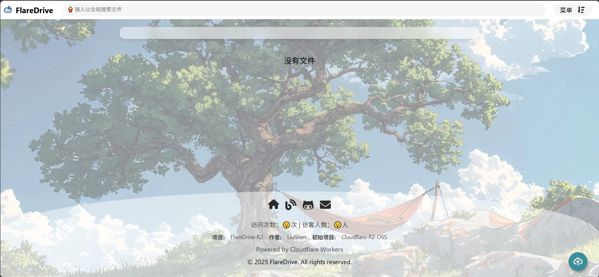
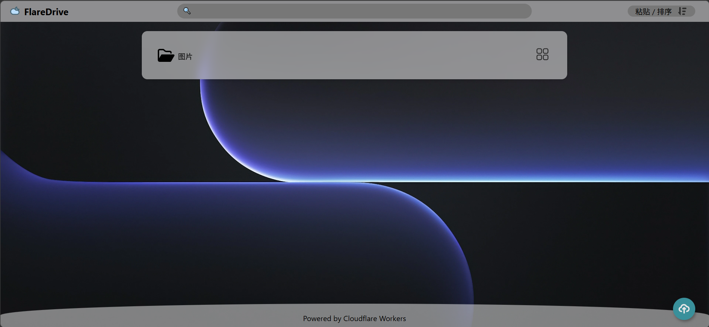
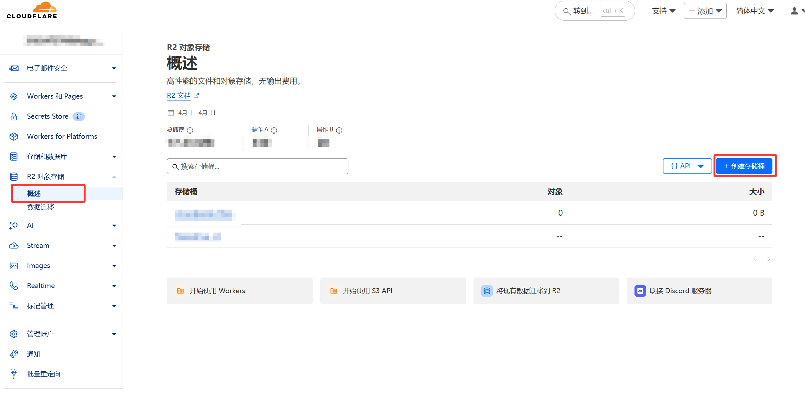
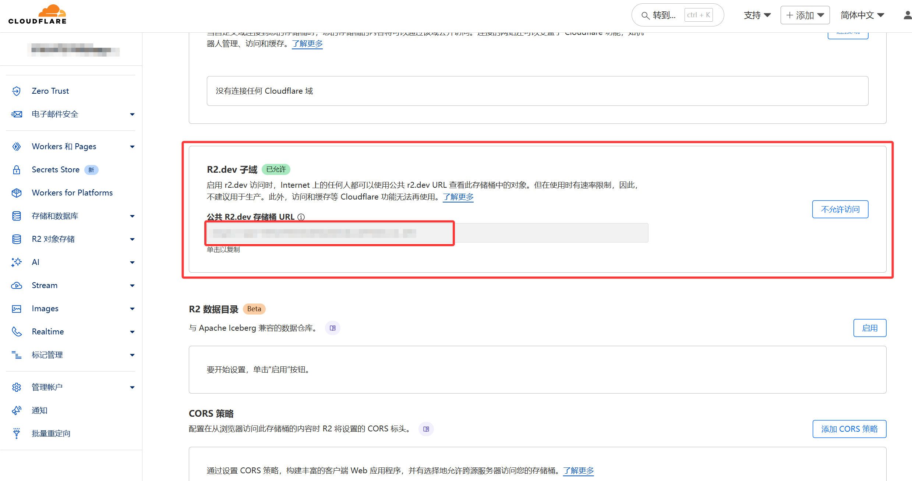
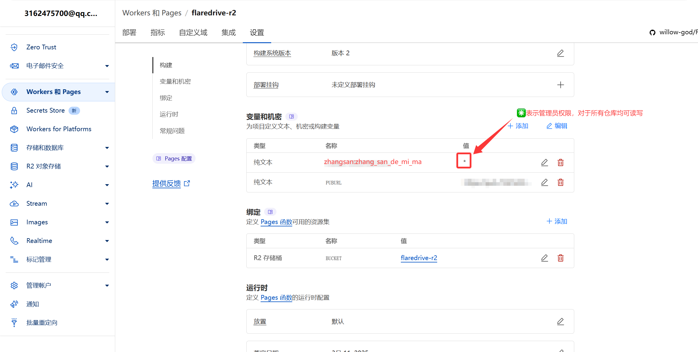

## R2-CloudDrive 使用文档

### 🌟 项目简介

R2-CloudDrive 是基于 Cloudflare R2 + Workers 构建的在线网盘系统，支持：
- 文件上传/下载/分享
- 多用户权限管理
- 目录级访问控制
- 静态文件托管

> 📌 本项目修改自 [FlareDrive-R2](https://github.com/willow-god/FlareDrive-R2)，主要做了一些精简和调整。

修改前：



修改后：



> 📌 上游的项目修改自 [Cloudflare-R2-oss](https://github.com/ljxi/Cloudflare-R2-oss)，实现了更加美观的前端页面。

### 🚀 快速部署

### 前置要求

- Cloudflare 账号
- 已开通 R2 服务

### 部署步骤

### 1. 准备存储桶

前往 Cloudflare R2 控制台：

1. 新建存储桶（建议名称全小写）

   

2. 创建完成后，点开设置页面，在存储桶设置中启用「公开访问」

   

3. 复制“公共存储桶 URL”，格式如下：

```txt
https://pub-kdsjfhlasnwiuweia4387rfho85tnof4.r2.dev
```

### 2. 部署 Pages 服务

1. Fork 本项目仓库到你的 GitHub
2. 打开 Cloudflare Pages，新建一个站点
3. 点击「连接到 Git」并选择你的仓库
4. 保持默认的构建设置即可，第一次构建不会显示内容，为正常现象

### 3. 配置环境变量



在 Cloudflare Pages 项目中，进入 **Settings → Environment Variables** 添加以下变量：

| 变量名         | 示例值                                                | 是否必要 | 说明                                           |
| -------------- | ----------------------------------------------------- | -------- | ---------------------------------------------- |
| `PUBURL`       | `https://pub-xxxx.r2.dev` | ✅ 必填   | R2 公共存储桶地址                              |
| `admin:123456` | `*`                                                   | ✅ 必填   | 管理员账号，格式为 `用户名:密码`               |
| `GUEST`        | `public/`                                             | ❌ 可选   | 游客写入的默认目录                             |
| `user1:123456` | `user1/,shared/`                                      | ❌ 可选   | 普通用户及其可写入目录，支持多个目录，格式一致 |

<p style="color: red !important; font-weight: bold;">
  ⚠️ 请勿开启 R2 存储桶的公开读写权限！否则你的存储资源可能会被恶意刷爆。
</p>

### 4. 绑定 R2 存储桶

部署完成后：

1. 进入 Cloudflare Pages 项目设置
2. 点击「R2 存储桶」
3. 添加一个绑定，变量名填写为：

```
BUCKET
```

并选择你的 R2 存储桶。

### 5. 重新部署项目

完成所有设置后，回到 Pages 控制台，点击「Deployments」页面右上角的「Trigger Redeploy」以重新部署服务。